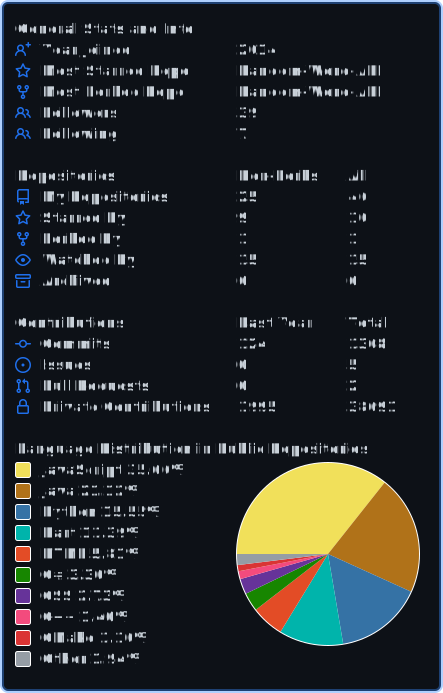
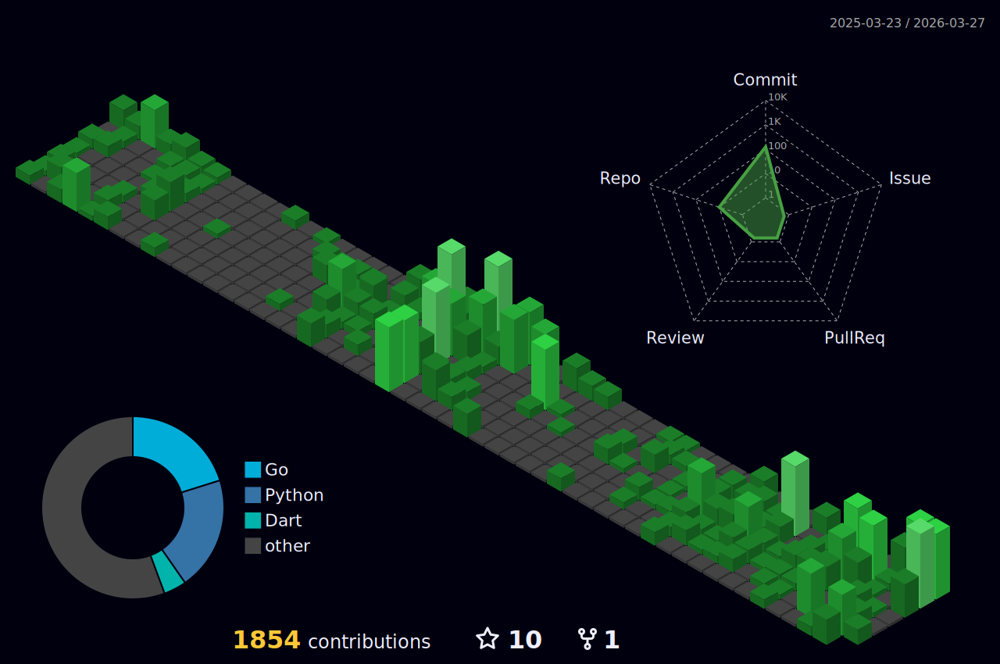

<h3 align="center">
  Welcome to Christian Lehnert's profile!
    
</h3>

  

## 🚀 About Me

- Born: 2000
- 🇩🇪

## 📇 Contact
Christian Lehnert - [@ChrLehnert](https://twitter.com/ChrLehnert) - <a href="mailto:Christian.lehnert@tutanota.com">Christian.lehnert@tutanota.com
</a>

## 📊 Stats

	

# Contributions
<h4 align="center">Isometric view of contributions in the last year. Languages pie is based on recent commits</h4>

	

## 🛠️ Skills

### Programming Languages

### Back-End

### Front-End

### Database

### Testing

### System

### IDE / Editor

