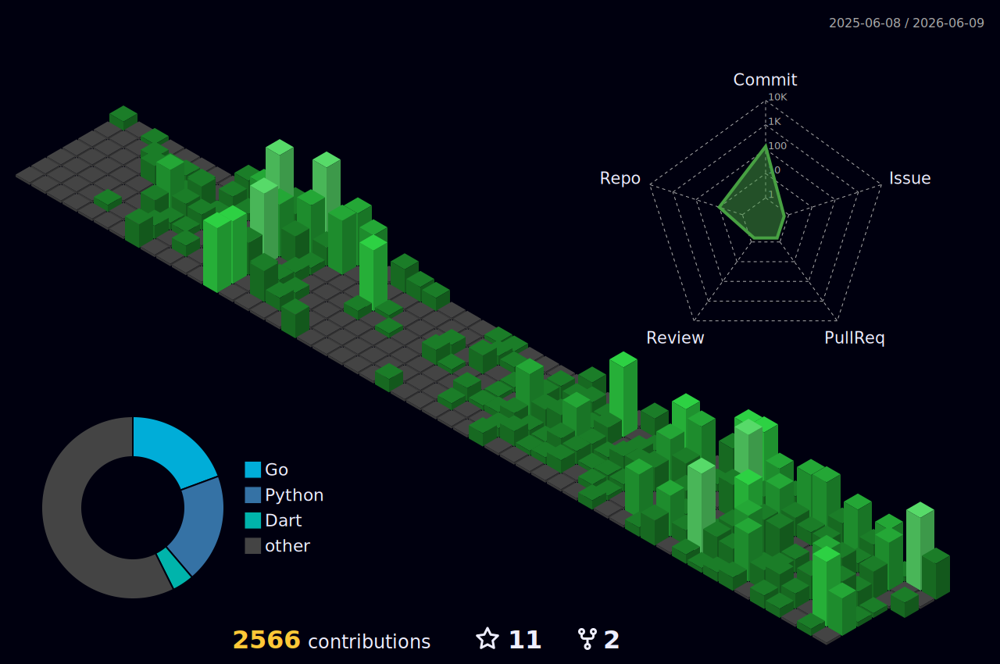

  Christian Lehnert &nbsp;·&nbsp; Backend & Security &nbsp;·&nbsp; Self-hosting since 2012 &nbsp;·&nbsp; 🇨🇭

  
  
  

## whoami

Software developer with a security focus. Java / Spring Boot, .NET / EF Core,
TypeScript, Python. Daily on Debian + i3 + tmux + HHKB. Daf Yomi reader.

I build things and self-host them. If a service runs on `c0xl.ch`, it runs on my own
hardware, behind my own perimeter, with my own keys.

## Currently

- **[c0xl.ch](https://c0xl.ch)** — personal infrastructure  
  
  
  
  
- **MCP servers** — `pdf.c0xl.ch` (Word→PDF), more in the queue
- **Homelab** — Proxmox cluster on Dell VRTX (3× M630 blades)

## Stack — the honest version

| Domain | Tools I actually use |
|---|---|
| **Languages** | Java · C# · TypeScript · Python · Bash |
| **Backend** | Spring Boot · Spring Security · .NET / EF Core · Node.js |
| **Data** | PostgreSQL · MariaDB · Redis |
| **Infra** | Debian · Docker · Proxmox · Caddy · WireGuard · `wstunnel` |
| **Network** | Cisco Catalyst · MikroTik RouterOS · VLAN / ZBFW design |
| **Security** | Web app pentesting · network hardening · self-hosted everything |
| **Editor** | Vim · IntelliJ · Rider |

## Contact

- [christian.lehnert@tutanota.com](mailto:christian.lehnert@tutanota.com)
- PGP fingerprint: `3618 EC2F 46B6 513F 8FC6  0444 7954 E03B 2988 C19B`

---

  

